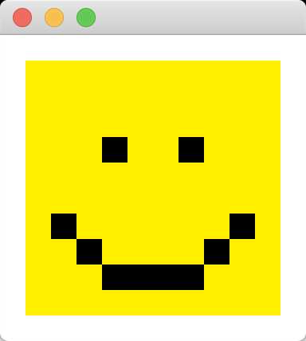
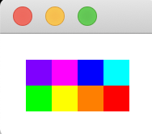

# PixelyImage
A small library to for novice students to practice working on small but slightly more substantial projects.

Includes a 4-byte image format to render rectangles on a grid.

Images are rendered with a 1-'pixel' white border.

## Binary Format
### Binary File
|Byte|meaning|
|-|-|
|0|Number of rows in the image|
|1|Number of columns in the image|
|2..(4 * total cells)|Pixels|

#### Pixel
|Byte|meaning|
|-|-|
|0|Red channel|
|1|Green channel|
|2|Blue channel|
|3|Alpha channel|

## Text Format
Specify the number of consecutive pixels followed by the pixel color.
* 14 colors are supported (see below table)
* 10x10 grid is supported (must use binary format for custom grid size)
* Example: `1R2G3B` would be 1 red pixel followed by two green pixels followed by three blue pixels

|Letter|Color|Hex value|
|-|-|-|
|'R'|Red|#FF0000|
|'G'|Green|#00FF00|
|'B'|Blue|#0000FF|
|'C'|Cyan|#00FFFF|
|'M'|Magenta|#FF00FF|
|'Y'|Yellow|#FFFF00|
|use lowercase letters for half-intensity values|||
|-|-|-|
|'W'|White|#FFF|
|'K'|Black|#000|

## Other Notes
* Create binary files with [hexed.it](https://hexed.it/)
* Design pixel art with [pixilart](https://www.pixilart.com/) or [GIMP](https://www.gimp.org/)
